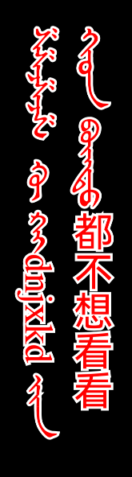
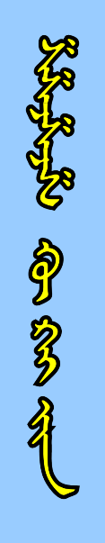
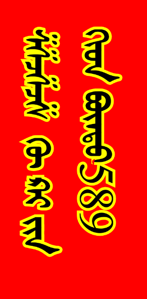

# mongoliantext

`mongoliantext` 是一个 ArkUI 组件模块，提供 `MongolianText` 组件，用于在 Canvas 中渲染蒙古文竖排文本，并兼容中蒙混排场景。

## 导出内容

- `MongolianText`

## 快速使用

```ts
import { MongolianText } from 'mongolian';
```

```ts
MongolianText({
  text: 'ᠡᠳᠡᠭᠡᠳᠡᠭ ᠡᠳᠡᠭ\\nᠡᠳᠡᠭᠡ ᠡᠭᠡᠳᠡᠭ',
  textSize: 26,
  lineSpacing: 8,
  autoHeight: true,
  maxHeight: 420,
  paddingLeft: 8,
  paddingTop: 8,
  textColor: '#111111',
  textBackGroudColor: '#F3F5F7'
})
```

## 参数说明

- `text`：要渲染的文本内容，支持字面量 `\\n` 换行
- `textSize`：字号（vp）
- `textColor`：文本颜色（`ResourceColor | string`）
- `textBackGroudColor`：背景颜色
- `lineSpacing`：竖排列间距
- `textCounterOutline`：描边宽度，`<= 0` 时不描边
- `textOutlineColor`：描边颜色，空字符串表示不启用描边
- `autoHeight`：是否根据文本自动计算高度
- `maxHeight`：`autoHeight = true` 时生效的最大高度
- `paddingLeft`：左内边距
- `paddingTop`：上内边距
- `preferredFontFamily`：自定义字体家族名（需与 `preferredFontFile` 配套）
- `inputSwitch`：是否执行字体注册（输入法场景建议开启）
- `preferredFontFile`：自定义字体文件名（位于 `resources/rawfile`）

## 配图展示





## 示例页面

已提供示例页面：

- `mongolian/src/main/ets/pages/MainPage.ets`
